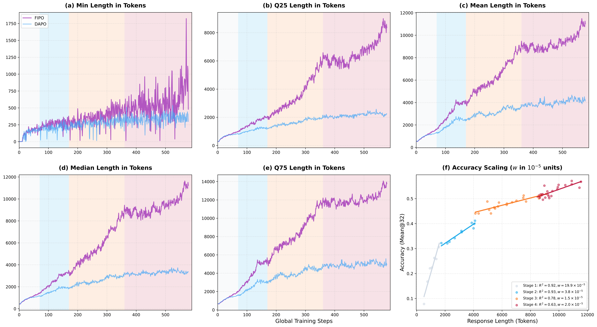

# FIPO: Eliciting Deep Reasoning with Future-KL Influenced Policy Optimization

## Kernel Optimization Fork

This fork is also used as a focused kernel-optimization workspace for the VeRL/FIPO training stack. The goal is practical: find hot paths, build fused CUDA/Triton kernels, benchmark them with synchronized timings, add parity tests, and only integrate a kernel into trainer code when it wins on representative shapes.

What changed in this branch:

- `Future-KL`, `returns + whiten`, `logprob + entropy`, `logprobs dispatch`, `entropy dispatch`, and `geo_mean` policy loss now have fused kernel paths or dispatcher upgrades.
- Each kernel keeps a torch reference path for correctness and regression testing.
- Integration is gated by representative benchmarks, so slower kernels stay as standalone references instead of becoming defaults.

| Area | Change | Representative gain |
| --- | --- | --- |
| `Future-KL` | Kept the fused reverse-scan kernel on the PPO hot path | `21.82x` on `32x2048 float32` |
| `returns + whiten` | Fused discounted returns with whitening for REINFORCE++ | `3.28x` on `32x2048 float32` |
| `logprob + entropy` | Combined logprob and entropy into one streaming kernel | `2.27x` on padded `16x2048x8192 float32` |
| `logprobs_from_logits` dispatch | Routed CUDA fallback through the gathered-logprob Triton helper | `7.45x` on padded `16x2048x8192 float32` |
| `entropy_from_logits` dispatch | Routed CUDA fallback through the streaming entropy kernel | `7.56x` on padded `16x2048x8192 float32` |
| `geo_mean` / GMPO | Delegated the trainer path to the fused GMPO helper | `2.17x` on `32x2048` |

For the kernel work log and queue, see:

- [Kernel rules](./KERNEL_RULES.md)
- [Kernel queue](./KERNEL_QUEUE.md)
- [.agents/kernel tasks](./.agents/kernel/tasks)
- [Kernel optimization blog](./docs/kernel_optimization_blog.md)
- [X post draft](./docs/x_post_kernel_optimization.md)

🏠 [Homepage](https://qwen-pilot.notion.site/fipo) | 📝 [Paper PDF](https://arxiv.org/abs/2603.19835) | 🤗 [Hugging Face](https://huggingface.co/QwenPilot) | 🤖 [ModelScope](https://modelscope.cn/models/chiyum609/FIPO_32B) | 🐱 [GitHub](https://github.com/qwenpilot/FIPO) | 📊 [SwanLab](https://swanlab.cn/@QwenPilot/FIPO?utm_source=website_qr&utm_medium=qr_scan)

**Qwen Pilot, Alibaba Group | Published on March 20, 2026**


FIPO is a **value-free RL recipe** for eliciting deeper reasoning from a clean base model. The central idea is simple: GRPO-style training works, but its token credit assignment is too coarse. FIPO densifies that signal with a **discounted Future-KL term** that reflects how the rest of the trajectory evolves after each token. Empirically, this granular reinforcement allows the model to **break through the length stagnation** observed in standard baselines. Trained on Qwen2.5-32B-Base, FIPO extends the average chain-of-thought length from **4,000 to over 10,000 tokens**, driving AIME 2024 Pass@1 accuracy from **50.0% to a peak of 58.0% compared with DAPO**.

## Overview


*Figure 1. FIPO vs. baselines on AIME 2024. FIPO shows that pure RL training alone can outperform reproduced pure-RL baselines such as DAPO and DeepSeek-R1-Zero-32B, surpass o1-mini, and produce substantially longer responses on average.*

**Highlights**

- **Pure RL only:** FIPO outperforms reproduced DAPO and DeepSeek-R1-Zero-32B, and surpasses o1-mini on AIME 2024.
- **Dense advantage formulation:** instead of assigning one uniform outcome-level signal to all tokens, FIPO reweights each token by the discounted signed shift of its future trajectory.
- **Deeper reasoning:** on Qwen2.5-32B-Base, FIPO breaks the usual 4k-token plateau and extends average reasoning length to **10,000+** tokens.
- **Stronger performance:** AIME 2024 Pass@1 improves from **50.0%** to a peak of **58.0%**.

## Core Change

FIPO keeps the standard PPO/DAPO scaffold, but changes how token-level updates are weighted. The local signal is the signed log-probability shift between the current and old policy:

$$
\Delta \log p_t = \log \pi_\theta(y_t \mid x, y_{1:t-1}) - \log \pi_{old}(y_t \mid x, y_{1:t-1})
$$

Positive values mean the token is being reinforced, while negative values mean it is being suppressed. Since reasoning is sequential, FIPO then accumulates this signal over the future trajectory:

$$
FutureKL_t = \sum_{k=t}^{T} M_k \cdot \gamma^{k-t} \cdot \Delta \log p_k
$$

Positive `FutureKL_t` means the future following token `t` is being reinforced; negative `FutureKL_t` means it is being suppressed. The decay window keeps the signal local enough to stay stable, while the mask removes extreme-ratio outliers.

FIPO maps this future signal into a bounded influence weight:

$$
f_t = clip(\exp(FutureKL_t), 1-\epsilon_{f,low}, 1+\epsilon_{f,high}), \quad \tilde{A}_t = \hat{A}_t \cdot f_t
$$

```text
FutureKL_t = discounted_sum_of_future_logprob_shifts(t)
weighted_advantage_t = A_t * clip(exp(FutureKL_t), low, high)
```

The final token-level FIPO loss keeps the standard clipped PPO/DAPO form, but replaces the original advantage with the future-aware one:

$$
r_t = \frac{\pi_\theta(y_t \mid x, y_{1:t-1})}{\pi_{old}(y_t \mid x, y_{1:t-1})}
$$

$$
L_t^{FIPO} = min(r_t \tilde{A}_t,\; clip(r_t, 1-\epsilon, 1+\epsilon)\tilde{A}_t)
$$


Tokens that lead into preferred futures are **amplified**, while tokens that lead into suppressed futures are **attenuated**. Clipping keeps this modulation stable. The final DAPO-style loss therefore stays clipped and simple, but the advantage term becomes **future-aware** rather than uniformly inherited from the final outcome.

## Getting Started

FIPO is built on top of the existing VeRL and DAPO training stack in this repository.

- For environment setup, please follow the standard VeRL installation and runtime setup first.
- Follow the standard VeRL environment setup and cluster preparation flow.
- Reuse the same Ray runtime pattern as the DAPO recipe.
- Use the new FIPO launcher in `recipe/fipo/` as the default 32B entrypoint.

Useful local references:

- VeRL docs: <https://verl.readthedocs.io/en/latest/start/install.html>
- DAPO recipe overview: [`recipe/dapo/README.md`](./recipe/dapo/README.md)
- DAPO baseline launcher: [`recipe/dapo/run_dapo_qwen2.5_32b.sh`](./recipe/dapo/run_dapo_qwen2.5_32b.sh)
- FIPO launcher: [`recipe/fipo/run_fipo_qwen2.5_32b.sh`](./recipe/fipo/run_fipo_qwen2.5_32b.sh)

## Training

The recommended launcher is:

```bash
bash recipe/fipo/run_fipo_qwen2.5_32b.sh
```

A typical submission flow looks like this:

```bash
cd FIPO
bash recipe/fipo/run_fipo_qwen2.5_32b.sh
```


## What changed in the scripts?

Compared with the DAPO 32B launcher, the FIPO launcher preserves the same overall training entrypoint and rollout structure, but changes the optimization behavior in a few important ways:

- `actor_rollout_ref.actor.ppo_mini_batch_size` is increased from `32` to `64` for better stability at 32B scale.
- `actor_rollout_ref.actor.policy_loss.loss_mode` switches from the default PPO-style objective to `future_kl`.
- FIPO-specific knobs are added through `policy_loss`, especially the Future-KL decay horizon, influence-weight clipping range, start mode, averaging behavior, and safety threshold.
- The practical effect is a training loop that stays very close to DAPO operationally, while making the **policy update itself** more future-aware and more robust for long-chain reasoning.

## 📊 Results & Figures

### Training Dynamics

The most important qualitative observation in FIPO is that performance gains are tightly coupled with **continuous response-length scaling**.

Under the DAPO baseline, response length grows at first and then gradually stalls around the 4k-token regime. Under FIPO, the model continues to expand its reasoning budget instead of collapsing into that intermediate plateau. This is not just a tail effect driven by a few unusually long samples. The response-length distribution shifts upward more broadly during training.

More importantly, these extra tokens are not merely verbosity. They increasingly support self-reflection, re-derivation, intermediate checking, and multi-pass verification. In other words, FIPO does not simply make the model speak longer. It helps the model use additional length as **genuine reasoning depth**.



*Figure 2. Dynamics of response length and performance scaling during training. Compared to the DAPO baseline, FIPO significantly increases response length and maintains a strong positive correlation between longer chain-of-thought and higher accuracy.*

### Main Result

FIPO is designed to lengthen and deepen reasoning under the same DAPO-style training scaffold rather than replacing the whole pipeline. In the paper's 32B setting, the main takeaway is straightforward: the FIPO objective yields longer responses and a stronger AIME 2024 peak than the DAPO baseline.

- DAPO baseline: **50.0%** AIME 2024 Pass@1
- FIPO: **58.0%** peak AIME 2024 Pass@1, converging around **56.0%**
- Response length: roughly **4k** to **10k+** tokens during training

The broader claim of the paper is that this gain comes from a stronger token-level credit-assignment mechanism, not from a separately trained value model or long-CoT warm-up supervision. FIPO shows that pure RL on a clean base model can already push reasoning trajectories much further than standard value-free baselines.


*Main 32B result figure. FIPO outperforms reproduced pure-RL baselines on AIME 2024 while also producing substantially longer responses on average.*

## 🎈 Citation

If you find this work useful, please cite:

```bibtex
@article{ma2026fipo,
  title={FIPO: Eliciting Deep Reasoning with Future-KL Influenced Policy Optimization},
  author={Ma, Chiyu and Yang, Shuo and Huang, Kexin and Lu, Jinda and Meng, Haoming and Wang, Shangshang and Ding, Bolin and Vosoughi, Soroush and Wang, Guoyin and Zhou, Jingren},
  journal={arXiv preprint arXiv:2603.19835},
  year={2026}
}
```

## 🌻 Acknowledgement

This project builds on top of the **VeRL** training framework and follows the practical recipe structure introduced by **DAPO**.

- VeRL repository: <https://github.com/volcengine/verl>
- DAPO recipe in this repo: [`recipe/dapo`](./recipe/dapo)
